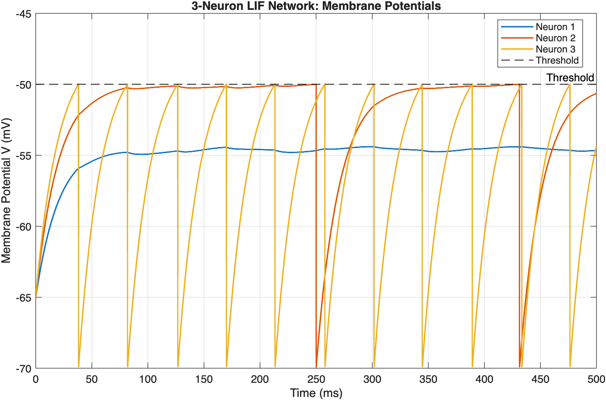
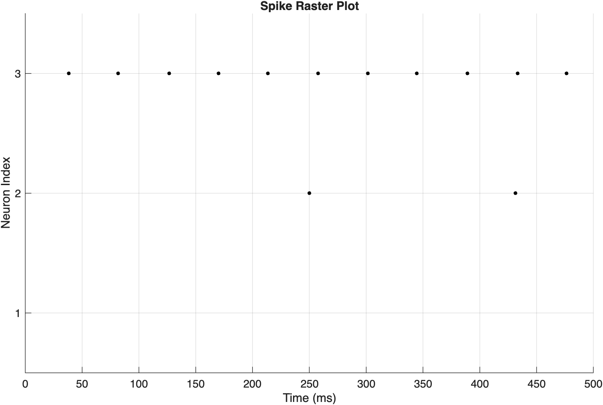
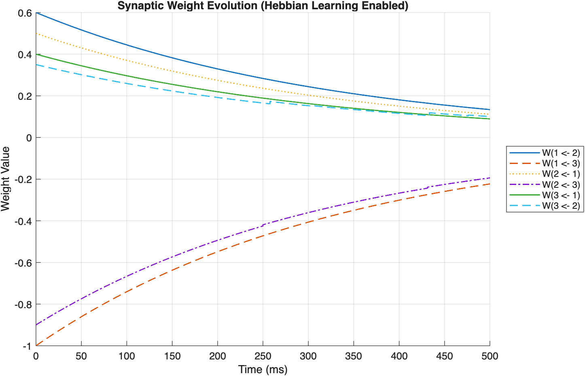

# Three-Neuron Leaky Integrate-and-Fire Network

This MATLAB project simulates a small network of three leaky integrate-and-fire (LIF) neurons. It is a time-dependent, low-dimensional ODE model solved with the forward Euler method.

The model includes:

- three interacting neurons;
- excitatory and inhibitory synaptic connections;
- a time-dependent external current for each neuron;
- threshold firing and membrane-potential reset;
- a simple Hebbian learning rule; and
- plots of membrane potentials, spike times, and synaptic weights.

## Model equations

For neuron `i`, the membrane potential follows

```text
dV_i/dt = (-(V_i - V_rest) + I_i(t) + sum(W_ij s_j)) / tau_m
```

The terms have simple roles:

- `-(V_i - V_rest)` makes the membrane potential leak back towards its resting value.
- `I_i(t)` is the external current supplied to neuron `i`.
- `W_ij s_j` is the input received from the other neurons.
- `tau_m` controls how quickly the membrane potential changes.

The Euler update used in the simulation is

```text
V_i(new) = V_i(old) + dt * dV_i/dt
```

When a neuron reaches the threshold, a spike is recorded and its voltage is reset:

```text
if V_i >= V_th
    spike_i = 1
    V_i = V_reset
end
```

The Hebbian rule strengthens a connection when the receiving neuron fires shortly after the sending neuron was active:

```text
W = W + eta * (current spikes * presynaptic trace) - weight decay
```

## Main parameters

| Parameter | Value | Meaning |
|---|---:|---|
| Number of neurons | 3 | Size of the network |
| Simulation time | 500 ms | Total model duration |
| Time step, `dt` | 0.1 ms | Euler step size |
| Membrane time constant, `tau_m` | 20 ms | Speed of membrane response |
| Resting potential, `V_rest` | -65 mV | Voltage with no input |
| Reset potential, `V_reset` | -70 mV | Voltage immediately after firing |
| Threshold, `V_th` | -50 mV | Voltage required to fire |
| Synaptic time constant, `tau_syn` | 10 ms | How quickly synaptic activity fades |
| External currents, `I_ext` | 10.5, 15.0, 17.5 | Baseline input to neurons 1, 2, and 3 |
| Learning rate, `eta` | 0.015 | Strength of Hebbian learning |
| Trace time constant | 30 ms | How long recent presynaptic activity is remembered |
| Weight decay | 0.0003 | Slowly reduces unused connections |

The starting weight matrix is

```text
W = [0.00   0.60  -1.00
     0.50   0.00  -0.90
     0.40   0.35   0.00]
```

It uses `W(post, pre)`: rows are receiving neurons and columns are sending neurons. Positive weights are excitatory, negative weights are inhibitory, and the diagonal is zero because self-connections are disabled.

## Running the simulation

1. Open `lif_neuron_network_code.m` in MATLAB.
2. Press **Run**, or enter `lif_neuron_network_code` in the Command Window.
3. MATLAB will open three figures showing the model output.

No additional MATLAB toolboxes are required.

## Results

### Membrane potentials

Each line rises with input and leaks over time. A neuron that reaches the -50 mV threshold fires and resets to -70 mV.



### Spike raster

Each dot marks the time at which one neuron fired. Dots aligned vertically show neurons firing together.



### Synaptic weights

This plot shows how each connection changes during the simulation because of Hebbian learning and weight decay.



## Repository contents

```text
3-neuron-lif-network/
|-- lif_neuron_network_code.m
|-- README.md
|-- results/
|   |-- membrane_potentials.png
|   |-- spike_raster.png
|   `-- synaptic_weights.png
`-- report/
    |-- Modelling_Report.docx
    `-- Modelling_Report_Final.pdf
```

## Coursework privacy

The report contains personal coursework information. Keep this repository private while the work is being assessed, and check the university's academic-integrity and publication rules before making it public.
